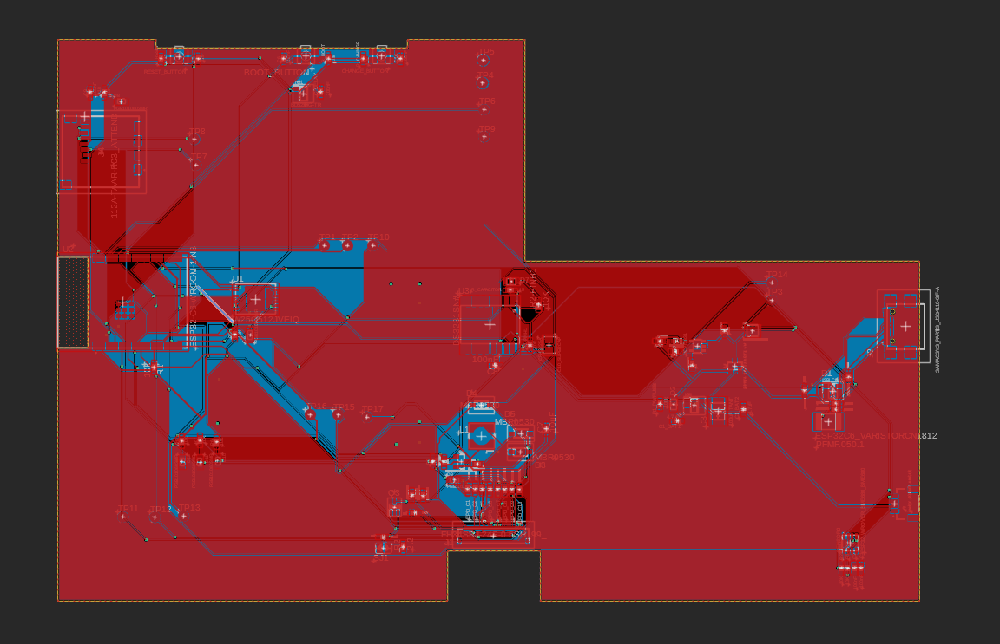

# OpenBook Project

## Overview
The OpenBook Project uses the **ESP32-C6 WROOM** module, which features:
- **Processor:** RISC-V single-core  
- **Memory:** 512 KB SRAM  
- **Connectivity:** Wi-Fi 6, Bluetooth 5, IEEE 802.15.4  
- **Interfaces:** GPIO, SPI, I2C, USB 2.0  

## Diagram

## ESP32-C6 Pin Descriptions

### Buttons
- **pin 3** → RESET  
- **pin 15** → IO/BOOT  
- **pin 23** → IO/RESET  

### Battery Level
- **pin 20** → pin 7 (SCL)  
- **pin 8** → pin 19 (SDA)  

### USB-C Connector & ESD Protection
- **pin 14** → pin 1 (USB_D+)  
- **pin 13** → pin 3 (USB_D-)  

### SD Card
- **pin 4** → pin 2 (SS_SD)  
- **pin 6** → pin 5 (SCK)  
- **pin 7** → pin 3 (MOSI)  
- **pin 27** → pin 7 (MISO)  

### BME688 Sensor
- **pin 17** → pin 2, 6, 8 (I2C_PW)  
- **pin 19** → pin 3 (SDA)  
- **pin 20** → pin 4 (SCL)  

### RTC Module DS3231SN
- **pin 8** → pin 3 (INT_RTC)  
- **pin 9** → pin 1 (32KHZ)  
- **pin 16** → pin 4 (RTC_RST)  
- **pin 19** → pin 15 (SDA)  
- **pin 20** → pin 16 (SCL)

## Hardware Description

| Part              | Description                                     |
|-------------------|-------------------------------------------------|
| DS3231SN          | -> high accuracy RTC                            |
| MAX17048G+T10     | -> battery fuel gauge                           |
| W25Q512JVEIQ      | -> serial NOR flash memory                      |
| FH34SRJ24S05SH99  | -> FFC connector                                |
| SI1308EDL-T1-GE3  | -> N-channel MOSFET                             |
| MCP73831          |-> charge management controller, single-cell     |
| USB4110           | -> USB 2.0 Type C connector                     |
| CPH3225A          | -> chip-type electric double-layer capacitor    |
| MBR0530           | -> surface-mount Schottky rectifier diode       |
| BME688            | -> environmental sensor                         |
| XC6220A331MR-G    | -> high-speed, low-dropout voltage regulator    |

## Bill of Materials

| Component Name       | Price (euro) | Link                                                                                                  |
|----------------------|--------------|--------------------------------------------------------------------------------------------------------|
| DS3231SN             | 14.91        | [Mouser](https://ro.mouser.com/ProductDetail/Analog-Devices-Maxim-Integrated/DS3231SN?qs=1eQvB6Dk1vhUlr8%2FOrV0Fw%3D%3D)  |
| MAX17048G+T10        | 4.28         | [Mouser](https://eu.mouser.com/ProductDetail/Analog-Devices-Maxim-Integrated/MAX17048G%2bT10?qs=D7PJwyCwLAoGnnn8jEPRBQ%3D%3D)    |
| W25Q512JVEIQ         | 5.84         | [Mouser](https://eu.mouser.com/ProductDetail/Winbond/W25Q512JVEIQ?qs=l7cgNqFNU1jw6svr3at6tA%3D%3D)    |
| FH34SRJ24S05SH99     | 2.60         | [Mouser](https://eu.mouser.com/ProductDetail/Hirose-Connector/FH34SRJ-24S-0.5SH99?qs=vcbW%252B4%252BSTIpKBl5ap9J8Fw%3D%3D)        |
| SI1308EDL-T1-GE3     | 0.41         | [Mouser](https://eu.mouser.com/ProductDetail/Vishay-Semiconductors/SI1308EDL-T1-GE3?qs=bX1%252BNvsK%2FBramh9tgpOaEw%3D%3D)         |
| MCP73831             | 0.70         | [Mouser](https://eu.mouser.com/ProductDetail/Microchip-Technology/MCP73831T-2ACI-OT?qs=yUQqVecv4qvbBQBGbHx0Mw%3D%3D)             |
| USB4110              | 1.18         | [Mouser](https://eu.mouser.com/ProductDetail/GCT/USB4110-GF-A?qs=KUoIvG%2F9IlYiZvIXQjyJeA%3D%3D)                          |
| CPH3225A             | 2.23         | [Mouser](https://eu.mouser.com/ProductDetail/Seiko-Semiconductors/CPH3225A?qs=3etwrb1wR%252BhUOph6lAO7eg%3D%3D)           |
| MBR0530              | 0.14         | [Mouser](https://eu.mouser.com/ProductDetail/Micro-Commercial-Components-MCC/MBR0530-TP?qs=KFo7JewZbUECRHkxGanrdg%3D%3D)        |
| BME688               | 9.86         | [Mouser](https://eu.mouser.com/ProductDetail/Bosch-Sensortec/BME688?qs=IS%252B4QmGtzzqQoVDscqwx3A%3D%3D)                    |
| XC6220A331MR-G       | 1.46         | [Mouser](https://eu.mouser.com/ProductDetail/Torex-Semiconductor/XC6220A331MR-G?qs=AsjdqWjXhJ8ZSWznL1J0gg%3D%3D)            |

## Additional Photos

  

